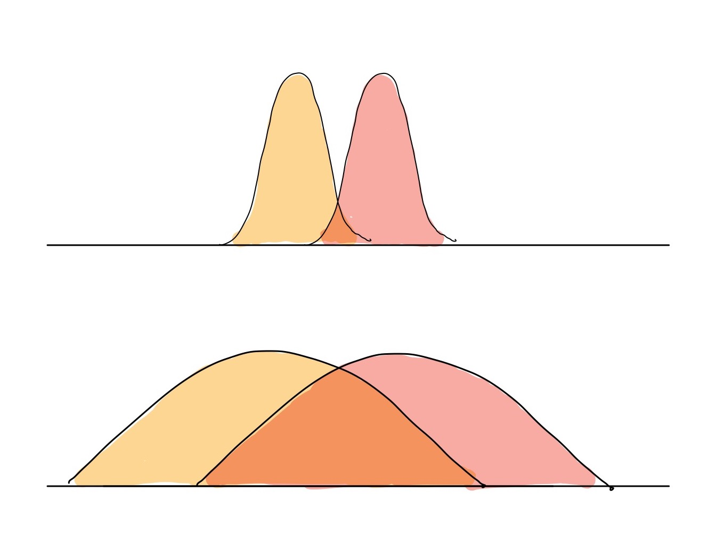
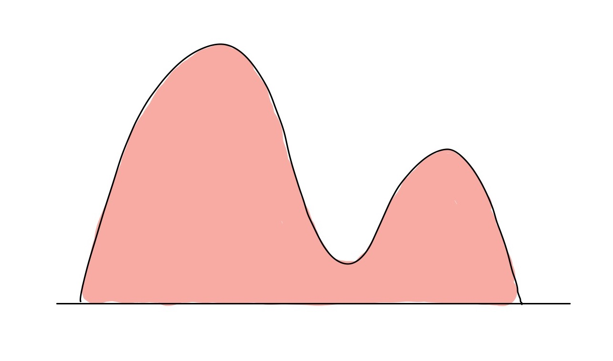

**Sasha Doubov**

The concept of KL divergence and cross-entropy comes up **all** the time in machine learning whether you are training a classification model or minimizing the [ELBO](https://en.wikipedia.org/wiki/Evidence_lower_bound). 

Today, I want to delve into the information theory roots of these two terms and how they apply to machine learning. This will be a teaser into information theory, which is a beautiful field whose insights are applied all the time in Machine Learning. 

I'll be covering it in 4 distinct parts:

1. Entropy
2. Information and Randomness
3. Cross-Entropy and KL divergence
4. Machine Learning

<!--- 
1. The motivation and high-level ideas behind KL divergence and cross-entropy
2. Entropy
3. Information and Randomness
4. Cross-Entropy and KL divergence
5. Machine Learning
--->

<!--- 
## KL Divergence: Motivation

At its core, KL divergence is all about measuring how different two probability distributions are.

As a refresher, a probability distribution $P(X)$ describes how much probability each outcome of the random variable $X$ is assigned. For example, if $X$ represents the outcome of a fair coin, then $P(X = tails) = \frac{1}{2}$ and $P(X = heads) = \frac{1}{2}$. Graphically, this looks like the following: 

Of course, probability distributions in the wild are usually more complicated than our simple heads/tails example. Hence, what we are looking for is some sort of function that quantifies the _distance_ between two distributions $P$ and $Q$ (Note: that the word _distance_ is underlined for a reason, but more on that later).

Why do we care about this problem? In machine learning, we often have some complicated _true_ distribution $P$ that consists of the data, and we are trying to learn a distribution $Q$ that approximates this true distribution. In order to learn this distribution, we need to know how close our model is to the true distribution, and voila, we need some _distance_ between the true distribution of our data and our learned model! 

Why can't we borrow a commonly used distance function, like squared euclidian distance, ie. $\sum_{x \in X}|p(x) - q(x)|^2$ ? Let's show this graphically. Below we have two different distributions, one with two sharp peaks with no overlap, and another with spread our distributions that have some areas that are far apart. 

If we use the Euclidian distance, the points in both distributions are pretty close together (in absolute terms) and so the value of this distance will be relatively small. For the overlapping distributions, the absolute values between the different points on the curve will be large, and so the euclidian distance will be relatively large.

This isn't how we want our function to work, as we want it to account for the shape of the distribution and have a small difference for the overlapping distributions, and a larger one for the non-overlapping ones.

Mathematically, one way to measure this is with the KL divergence, which is defined as:
$$
D(P || Q) = \sum_{x \in X} P(x)\log(\frac{P(x)}{Q(x)})
$$
--->

## Entropy

What is entropy and why do we use care about in machine learning? Entropy comes up in many fields, including physics, thermodynamics, but today I'll be discussing it in terms of _information_.

Mathematically, entropy is defined as: 
$$
H(X) = \mathbb{E}_{x \sim P}[\log \frac{1}{P(X)}] = \sum_{x \in X} P(x)\log \frac{1}{P(x)}
$$
where $X$ is a random variable and $P$ is a distribution.

What does this value represent? Intuitively, it measures how many _bits_ are needed to describe a variable $X$ (when using $\log$ base 2). A _bit_ is a unit in computing, which can only be a 1 or 0. 

This is best illustrated through an example:

Suppose we are trying to transmit 4 possible letters, A, B, C, D using a binary code (made up of 1s and 0s). 

Suppose that the symbols occur with the following frequencies:

| Symbol - $X$    | Frequency - $P$ |
|:-------------:|:-------------:|
| A             |  1/2          |
| B             | 1/4           |
| C             | 1/8           |
| D             |  1/8          |

How should we assign a binary code to these symbols? The natural approach is to simply assign 2 binary digits per symbol, as follows:

| Symbol - $X$  | Frequency - $P$   | Code  |
|:-------------:|:--------------------:|:-----:|
| A             | 1/2                  | 00    |
| B             | 1/4                  | 01    | 
| C             | 1/8                  | 10    |
| D             | 1/8                  | 11    |

Next, we'll assume that we are trying to transmit some random sequence of these symbols A, B, C, D, which will naturally follow the distribution $P$. Since we don't know what the message is actually going to be, we'll want to find the _expected_ length of the code, where $L(X)$ denotes the length of the assigned code to the symbol.

$$
\mathbb{E}[L(X)] = \sum_{x} P(x) L(x)
$$

In this case, all the codes have length 2, so the expectation is:

$$
\mathbb{E}[L(X)] = \sum_{x} P(x) L(x) = \frac{1}{2} \cdot 2 + \frac{1}{4}  \cdot 2  + \frac{1}{8}  \cdot 2  + \frac{1}{8} \cdot 2 = 2
$$

This means that the average length of transmitted code is 2. For example, if we were to send a message consisting of A, B, C, D of length 10, on average this would require 20 digits! While this approach is intuitive, it's not optimal. Why? We aren't making use of the different probabilities assigned to each symbol. Instead, let's try using:

| Symbol - $X$  | Frequency - $P$   | Code  |
|:-------------:|:--------------------:|:-----:|
| A             | 1/2                  | 0    |
| B             | 1/4                  | 10    | 
| C             | 1/8                  | 110    |
| D             | 1/8                  | 111    |

The expected average length of the code is:

$$
\mathbb{E}[L(X)] = \sum_{x} p(x) L(x) = \frac{1}{2} \cdot 1 + \frac{1}{4}  \cdot 2  + \frac{1}{8}  \cdot 3  + \frac{1}{8} \cdot 3 = 1.75
$$

Which is shorter than 2. What's more, this is _exactly_ equal to $H(X)$ (entropy), since:

$$
H(X) = \sum_{x \in X} P(x)\log  \frac{1}{P(x)} = \frac{1}{2} \cdot \log 2 + \frac{1}{4}  \cdot \log 4  + \frac{1}{8}  \cdot \log 8  + \frac{1}{8} \cdot \log 8 = 1.75 
$$

This is no coincidence! In fact, entropy gives us the minimum number of bits needed to describe a symbol $X$. If we do some pattern matching between $H(X)$ and $\mathbb{E}[L(X)]$, we recognize that the length of the optimal code for a symbol should be $\log \frac{1}{P(X)}$. As with our formula for expected length, the entropy equation itself is an expectation, ie:
$$
H(X) = \mathbb{E}[\log \frac{1}{P(X)}] = \sum_{x \in X} P(x)\log  \frac{1}{P(x)}  
$$

 Note, that in our example, $P$ had values that were powers of 2, which means that for each value of X, the length is a nice, whole number. What happens if it's not a power of 2? We can't transmit a fraction of a bit through our system _but_  we can imagine that if we had to send a really long message string, the _average_ number of bits we need would indeed be $H(X)$.

**Takeaways:** Entropy, $H(X)$ measures how many bits are needed to describe a symbol $X$ that follows a distribution $P$.

## Entropy and Randomness

In the last section, I described the formula for entropy and discussed what it means. In this section, I'm going to make the math concrete, with a more tangible example.

Let's assume Bob is a statistics nerd who's been sending the weather of his travels to his fiance, Alice. He stays at a place in the country, and then sends a binary code at the end of the trip that tells her all the days that it's been rainy and sunny.

First, Bob stays in San Francisco for 100 days (they have a long-distance relationship). There, he knows that the weather follows the following pattern:

| Weather - $X$  | Frequency - $P$   |
|:-------------:|:--------------------:|
| Rain             | 1/2                  | 
| Sun             | 1/2                  |  

What binary code should he use to tell Alice the weather? Here, every day is equally likely to have rain or sun, so he just encodes rain = 1, sun = 0. The length of his message will be 100 bits long (binary digits) and so the average amount of information per day in SF is 1 bit.

Next, he visits Nevada - Death Valley for 100 days. There, he knows the weather follows this pattern:

| Weather - $X$  | Frequency - $P$   |
|:-------------:|:--------------------:|
| Rain             | 1/100                  | 
| Sun             | 99/100                  |  

Here, Bob believes that _on average_, he should only get 1 day of rain in his 100 day stay. Hence, he changes his code to be the _day on which rain occurs in Death Valley_. Ex. if it rains on the second day, he sends the binary symbol for a 2 ie. 01. For this code, he needs to be able to send the binary messsage for at most 100, in case it rains on the 100th day. This means that the total message length is $\log 100$ because the number 100 in binary is 1100100. Hence, he'll be sending a messsage that is  ~7 digits long. 

Hence, the average amount of information per day in Death Valley is ~0.07, since ~7/100 = 0.07.

Does this match up with our definition of entropy? Let's substitute the frequencies from our tables for SF and Death Valley.

In SF:
$$
H(X) = \frac{1}{2} \cdot \log 2 + \frac{1}{2} \cdot \log 2  = 1 
$$

In Death Valley:

$$
H(X) = 0.01 \cdot \log 100 + 0.99 \cdot \log 0.99  \approx  0.01 \cdot \log 100  = 0.0664
$$

(Because $\log 0.99 \approx \log 1 = 0$)

As before, we see that the definition of entropy matches up with Bob's coding scheme. 
Now, a couple questions may arise:

1. What if it rains more than 1 day in Death Valley? How will Bob send Alice the weather then?
2. Why is it that the more unpredicatble the weather, the more bits of information it contains?

These are both very good questions. For Question 1, the answer is that this isn't a practical code but instead a code for the "average case". This is reasonable because we can prove that when you observe a lot of events/symbols in a sequence, it becomes very likely that the frequency of the symbols will match your distribution. For example, Bob can reasonably expect to get around 1/100 days of rain if he stays in Nevada for 1 million days.

Question 2 is a key insight into what entropy is actually measuring. One can think of entropy as the amount of uncertainty about something. Intuitively, it's harder to compress random sequences than patterned ones, because you can't leverage any patterns in the random sequences! For a discrete set of symbols, variables that come from a uniform distribution (each symbol is equally likely), are the ones that have highest entropy, ie: the highest uncertainty/information.

## KL Divergence and Cross Entropy

Now, you should have a pretty good idea of what entropy is. Where does cross-entropy come in?

As we said before, entropy tells us how many bits are needed to describe a symbol $X$ given that it follows a distribution $P$. But what happens if we don't know the distribution $P$? Well in this case, we want to figure out just how bad (how long) our code will be if we don't know it. Of course, we can make some assumptions about what $P$ looks like and approximate it with a distribution, say $Q$.

From our entropy term, we know that $\log \frac{1}{P(X)}$ gives us the length of the code we should use for $X$. But if we don't know $P$, but we do know $Q$, the length of our code is now: $\log \frac{1}{Q(X)}$. 

As before, we want to figure out how long the average code is using this scheme, which means that we use expectation. Note that, the expectation is with respect to the distribution $P$, since the variable follows that distribution, not our approximated $Q$ term.

$$
\mathbb{E}_{x \sim P}[\log \frac{1}{P(X)}] = \sum_{x \in X} P(x)\log  \frac{1}{Q(x)} 
$$

In fact, this _is_ cross entropy (denoted by $H(p, q)$! In other words, we are measuring how many bits we will need to describe a symbol $X \sim P$ if we use a coding scheme meant for $X \sim Q$. 

In the last section, we learned that the optimal code for $X \sim P$ is given by $H(X)$. A natural question to ask is, how many more extra bits do we need to use when using the "wrong" code for $Q$ compared to the optimal code? This is simply $H(P, Q) - H(P)$ or:

$$
 D_{KL}(P || Q) = H(P, Q) - H(P) = \sum_{x \in X} P(x)\log  \frac{1}{Q(x)}  - \sum_{x \in X} P(x)\log  \frac{1}{P(x)}  =\sum_{x \in X} P(x)\log  \frac{P(x)}{Q(x)} 
$$

Here, I've taken the extra-step and equated the term $D_{KL}(P || Q)$ to this expression, or the KL divergence. In other words, KL divergence measures the relative gain of bits that we require to encode our symbol if we are using a different code.

(Small note on notation, I have used $H(X)$ to denote entropy throughout the section, but when writing out the expression for KL divergence, I replaced it with $H(P)$ to make it clear that we are referring to entropy where $X \sim P$)

### Further details on KL-Divergence

There are several properties of KL divergence that make it useful as a sort of "distance" function between probability distribution. As we saw previously, the KL divergence measures how many relative bits we require to encode our symbol $X$ if we are assuming that it follows the distribution $Q$ rather than $P$. 

First, the KL divergence is always non-negative. This means that we need extra bits to encode X when we use a distribution $Q$ to approximate $P$, *unless* we are able to find the exact $Q = P$.

To be more mathematically precise, $D_{KL}(P || Q) \geq 0$ and $D_{KL}(P || Q) = 0 \text{ if and only if } P = Q$.

These two properties are convenient for measuring distances, similar to how we would imagine using a tape measure:

- The length from my start point to my end point is never negative
- If my start and end point are in the same spot, then my length is zero. Also, if my length is zero, that means my start and end point are the same.

There is, however, a nuance compared to the tape measure case. The length from point A to B should be the same as the length from B to A, *but* with the KL divergence, this isn't the case, as the KL divergence is not symmetric!

This means that $D_{KL}(P || Q) \neq D_{KL}(Q || P)$. 

However, we can still use it as a sort of distance measure between two different probability distributions, as long as we are careful. 

## Machine-learning

We've now spent a considerable amount of time discussing bits, symbols and Bob's weird fascination with the weather. Where do the concepts of entropy apply in machine learning?

For this part, I want to focus on cross-entropy and KL divergence separately, and we'll be looking at two settings:

1. KL divergence as a probability measure
2. Cross-Entropy Loss

### KL Divergence for probability distributions

In machine learning, we often have some complicated _true_ distribution $P$ that consists of the data, and we are trying to learn a distribution $Q$ that approximates this true distribution. In order to learn this distribution, we need to know how close our model is to the true distribution, and voila, we need some _distance_ between the true distribution of our data and our learned model! 

Why can't we borrow a commonly used distance function, like squared euclidian distance, ie. $\sum_{x \in X}|p(x) - q(x)|^2$ ? Let's show this graphically. Below we have two different distributions, one with two sharp peaks with with little overlap, and another with spread out distributions that have some areas that are far apart. 

If we use the Euclidian distance in the top image, the points in the distributions are pretty close together (in absolute terms) and so the value of this distance will be relatively small. For the distributions at the bottom of the image, the absolute values between the different points on the the two curves will be large, and so the euclidian distance will be relatively large.

This isn't how we want our function to work, as we want it to account for the shape of the distribution and have a small difference for the overlapping distributions, and a larger one for the non-overlapping ones.

How does the KL divergence account for this? As we know, it tells us how many more bits are required to encode another distribution if we assume that we are encoding from our distribution. This inherently captures the "shape" of the distribution and it both intuitively and theoretically captures the property of accounting for how much overlap is present within the distributions.

Another cool connection is that Maximum Likelihood Estimation (ie. maximizing the MLE term) is actually equivalent to minimizing the KL divergence, as derived in this [blog post](https://wiseodd.github.io/techblog/2017/01/26/kl-mle/). This requires some further background but is highly recommended reading for those interested!

#### Support
In the information theory setting, we assumed that our "alphabet" of symbols $X$ was the same for the distributions $P$ and $Q$. However, this doesn't always have to be true, and the _support_, the places where each distribution has non-zero values, might be different for both distributions. 

To make that even more clear, the support of the distribution $P$ is wherever $P(x) \neq 0$ for some $x$. 
If we look at our usual definition of KL divergence as:

$$
 D_{KL}(P || Q) = \sum_{x \in X} P(x)\log  \frac{P(x)}{Q(x)}
$$

We notice that there's a fraction $\frac{P(x)}{Q(x)}$ within the $\log$ term. If $Q(x)$ is 0 for some $x$ but $P(x) \gt 0$, then this term blows up and goes to infinity! More mathematically, we need the _support_ of $P$ to be within $Q$, otherwise the KL divergence goes to infinity.

#### Forward and Reverse KL

We've discussed that KL divergence can be used to measure the distance between distributions, through this lens of information gain. When does this come up in practice?

Similarly to the information theory setting, we can assume that there is a true distribution $P$ that we are trying to approximate with the distribution $Q$. 

First consider minimizing $D_{KL}(P || Q)$, the usual KL divergence term. This is called *forward-mode* KL divergence, where we are measuring the KL divergence assuming that $P$ is the true distribution (as it should be).

However, we can equally speak about *reverse-mode* KL divergence, where the "true" distribution is our approximated distribution $Q$ which is defined as $D_{KL}(Q || P)$

Why does this matter? KL divergence is not symmetric (in general) so $D_{KL}(P || Q) \neq D_{KL}(Q || P)$

Here's the rule of thumb that I like to use: if we have supervision/labelled data, we should be using *forward mode* KL divergence, and if we do not, we should use *reverse-mode* KL divergence. In essence, the labels/supervision give us the true distribution in our problem, so we should opt to use that if we can.

Let's get a little more insights into how these two behave differently. We'll be trying to fit a distribution to the following "true" distribution $P$, shown here:

We are trying to minimize either the forward KL or reverse KL, which means that we'll be trying to fit a distribution $Q$ that minimizes either one of these "distances".  

#### Forward Mode KL

As before, we can decompose the KL divergence into cross-entropy and entropy terms:

$$
 D_{KL}(P || Q) = H(P, Q) - H(P)
$$

In the forward KL case, we have no control over the entropy term $H(P)$ which isn't a function of $Q$ and the best we can do is minize the cross-entropy term $H(P, Q)$. 

The cross-entropy term is:

$$
H(P, Q) = \mathbb{E}_{x \sim P}[\log \frac{1}{Q(x)}] = \sum_{x \in X} P(x)\log  \frac{1}{Q(x)} 
$$

As we saw in the _support_ section, if $P(x) > 0$ but $Q(x) = 0$, the cross-entropy goes to infinity. To avoid this when minimizing the loss, our approximated $Q(x)$ will spread out to be defined everywhere that $P(x)$ has support. 

Visually, this looks like the following (where the red curve is $P$ and the blue curve is $Q$):

This behaviour is called _zero-avoiding_, as the approximated distribution avoids being $0$ in places where the true distribution is _non-zero_.

The other major quality of the cross-entropy term is that our approximated distribution $Q$ should have high probability where $P$ has high probability. _However_, the forward KL does not heavily penalize those places where $P$ is low, but $Q$ is high (such as the spot between the two peaks of the red curve). This is called _mean-seeking_ behaviour.

#### Reverse Mode KL

We can do a similar decomposition to the reverse mode KL as we did for the forward KL:

$$
 D_{KL}(Q || P) = H(Q, P) - H(Q)
$$

where:

$$
H(Q, P) = \mathbb{E}_{x \sim Q}[\log \frac{1}{P(x)}] = \sum_{x \in X} Q(x)\log  \frac{1}{P(x)}
$$

and 

$$
H(Q) = \mathbb{E}_{x \sim Q}[\log \frac{1}{Q(x)}]  = \sum_{x \in X} Q(x)\log \frac{1}{Q(x)}
$$

How does the reverse KL behave? The entropy term $H(Q)$ grows larger when the distribution $Q$ is more spread out (recall: more spread out == more "uncertainty", leading to higher entropy). This term stops our approximated distribution $Q$ from being too narrow.

The cross-entropy term behaves differently than in the forward mode KL case. Here's a visual example:

The _support_ of $P$ is no longer a critical factor in our approximated distribution, as the $Q$ curve might only overlap with part of the $P$ distribution. This is known as _zero-forcing_ behaviour, because our approximated $Q$ may ignore parts of the distribution where $P$ is lower and force it to go to $0$.

Similarly, the cross-entropy term is minimized when samples in $Q$ that have high probability also have high-probability under $P$. Combined with the _zero-forcing_ behaviour, the reverse KL collapses on one of the peaks (or the _modes_) of our true distribution $P$, since that is high probability under $Q$. This leads to to the reverse KL having _mode-seeking_ behaviour, where it might collapse to one of the peaks/modes of the true distribution.

**Takeaways**: KL divergence behaves differently depending on whether $P$ or $Q$ is the true distribution. Unfortunately, we do not always have a choice between forward and reverse KL. This depends on where we can get _samples_ of $x$ from, to estimate the expectation term in the KL divergence. 

If we have supervision/labelled data, we can get samples $x$ from the true distribution $P$, and so we can use forward KL.

In an unsupervised ML setting, we are only be able to sample $x$ from $Q$, so we are forced to use the reverse KL. 

Still, it's useful to understand the differences between the two directions of KL divergence when you are implementing real-world machine learning models! 

### Cross-Entropy Loss

Let's assume that we are performing a classification task, with three classes, cats, dogs, and lizards. We've built some fancy neural network model $f$, that takes in an image $x$, and outputs a prediction: $\hat{y} = f(x)$. For our problem, we know that the actual class of image $x$ is $y$, and we want to optimize our model such that we can predict $\hat{y}$ "close" to $y$.

First, we will squash the output of our neural network so that our output $\hat{y}$ looks like a probability distribution. We want this probability distribution to tell us how likely it is that $x$ belongs to our 3 classes: cat, dog and lizard, so our $\hat{y}$ looks like a vector of length 3, whose elements sum to 1, and each term is non-zero. We can do this with the [softmax](https://en.wikipedia.org/wiki/Softmax_function) function, which can take some arbitrary numbers and squish them into a nice probability distribution.

Next, we know our true class label, $y$. To make sure that this aligns with the output of our vector $\hat{y}$, we turn this into a vector of length 3, assigning a 1 to the correct class and a 0 to the incorrect class. Notice how this also sums to 1 and satisfies the properties of a probability distribution!

Now, we have two vectors $y$ and $\hat{y}$, which we interpret as two probability distributions, $P$ and $Q$. We would like to minimize the difference between these two distributions. Here, our true distribution is $P$ and our approximated distribution is $Q$. 

Let's make this concrete with a picture:

First, notice that having the label $y$ tells us that the true distribution for the image $x$ is $P$, which we are approximating with $Q$.

Now, which one of our two main concepts should we apply: KL divergence or cross-entropy? Our gut instinct might be KL divergence, after all, there was a whole section on using it to measure distances between probability distributions. 

Let's write out the expression for KL divergence, in terms of entropy and cross-entropy:
$$
 D_{KL}(P || Q) = H(P, Q) - H(P)
$$

Here, notice that the second term, $H(P)$ does not depend on our classifier, as that is the entropy of the true distribution and is outside of our control! Hence, if we want to minimize this term, we may as well minimize the cross-entropy $H(P, Q)$, which is affected by our classifier output.

When we want to minimize something in optimization, we typically call it a "loss" function, and so we label the term $H(P,Q)$ as the cross-entropy loss. Returning to our example, here's how that looks like:

There's a couple of simple tricks in there that make the calculation a little different from what we've seen before. We use the simple $\log$ identity: $\log (\frac{1}{x}) = -\log(x)$ to get rid of the fraction in the cross-entropy loss term. We also replace the summation of each term with a dot product between the two vectors representing $P$ and $Q$.

After applying these tricks, we see that the cross-entropy loss is 0.322, which represents the average number of bits needed to encode the cat image using our model. Note that the true distribution $P$ is fully deterministic, with no uncertainty (ie. $x$ is always a cat), and so the entropy is zero! This means that our predictor still has some ways to go before it can perfectly predict the cat image and obtain zero loss. 

So, we now know that the cross-entropy loss term refers to how many bits of information we need to encode the actual label of our cat image $x$, with the code that we made with our model $Q$. That's the story behind cross-entropy loss!

### Summary

To conclude, entropy, cross-entropy and KL divergence are concepts in information theory that measure how much information can be gained and have deep ties to the loss functions in machine learning. Please take a look at the references below for more details and cool insights!

### References

- Professor Wei Yu's information theory [course](https://www.comm.utoronto.ca/~weiyu/ece1502/)
-  Textbook: [Elements of Information Theory](http://staff.ustc.edu.cn/~cgong821/Wiley.Interscience.Elements.of.Information.Theory.Jul.2006.eBook-DDU.pdf)
-  Blog Post: [KL Divergence: Forward vs Reverse?](https://wiseodd.github.io/techblog/2016/12/21/forward-reverse-kl/)
- Blog Post: [KL Divergence for Machine Learning](https://dibyaghosh.com/blog/probability/kldivergence.html)
- YouTube Video: [A Short Introduction to Entropy, Cross-Entropy and KL-Divergence](https://www.youtube.com/watch?v=ErfnhcEV1O8&t=350s)
- Blog Post: [Maximizing likelihood is equivalent to minimizing KL-Divergence](https://wiseodd.github.io/techblog/2017/01/26/kl-mle/)